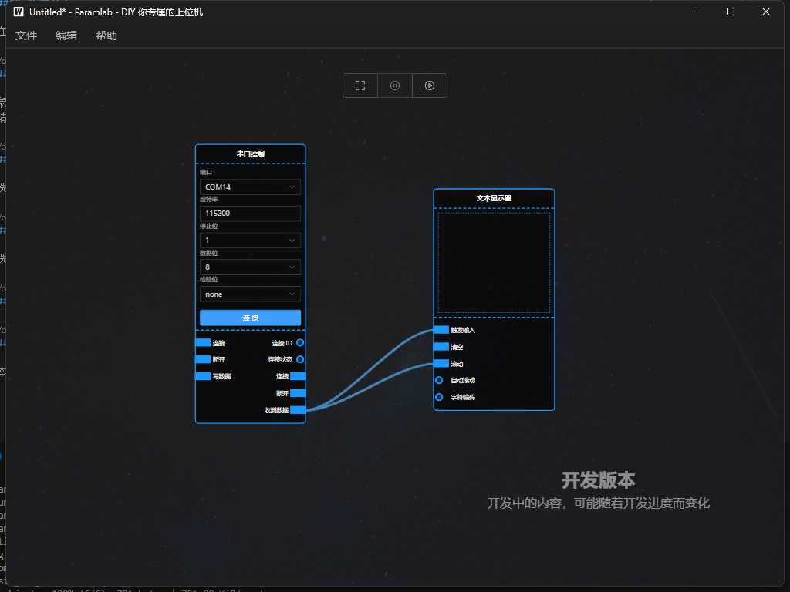
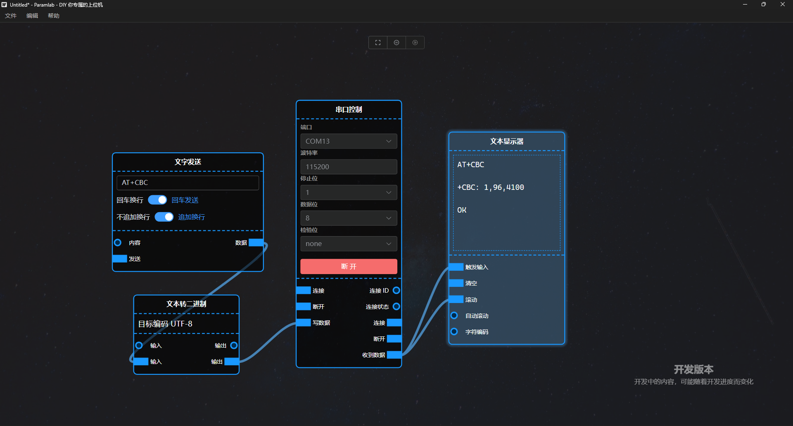

# ParamLab - DIY Your Own HMI

## Introduction

`ParamLab` offers a new HMI (Human-Machine Interface) mode, unlike traditional HMIs. `ParamLab` utilizes a visual programming model similar to UE4 Blueprints. This mode seamlessly combines programming with data display. Even without programming experience, you can quickly assemble an HMI that meets custom requirements by connecting nodes with a mouse.

## Development

### Environment

This project is based on the `Wails` framework. Please refer to the [Wails documentation](https://wails.io/zh-Hans/docs/gettingstarted/installation) for `Wails` environment installation.

### Run in Development Mode

```bash
wails dev
```

### Build

```bash
wails build
# or use upx to compress, smaller size
wails build -upx
```

### Technology Stack

- element-plus provides some components
- retejs provides a visual programming framework
- vue3 + typescript + vite basic framework
- wails provides cross-platform support

## Usage

### Download

Please visit the [release](https://github.com/hempflower/ParamLab/releases) page to download the latest version.

In newer versions of Windows 10 or Windows 11, you can run the program directly without installing any dependencies.
In older versions of Windows, you need to install the WebView2 runtime. Download link: https://developer.microsoft.com/en-us/microsoft-edge/webview2/

Linux and macOS theoretically support it, but it's untested. Feel free to try, and if you encounter any issues, please raise an issue.

### Edit Nodes

#### Create Nodes

Right-click in the editor area and choose the node type you want to add. The node will be added to the mouse position.

#### Connect Nodes

Drag the output port of one node to the input port of another node with the left mouse button to connect the two nodes.
Note that not all output ports of a node can connect to all input ports. Only ports of matching types can connect.

#### Run

Select the run button in the editor's floating toolbar to run the current node combination.

#### Save and Load

Choose "File"->"Save" to save the current node combination. The saved file is in JSON format and can be opened with a text editor.

Choose "File"->"Load" to load a saved node combination.

## Screenshots





## License

ParamLab is licensed under the GPL V3 License. See [LICENSE](./LICENSE) for the full license text.
